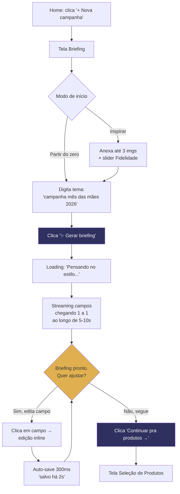
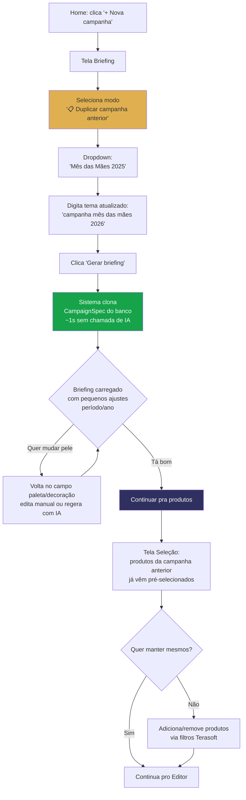
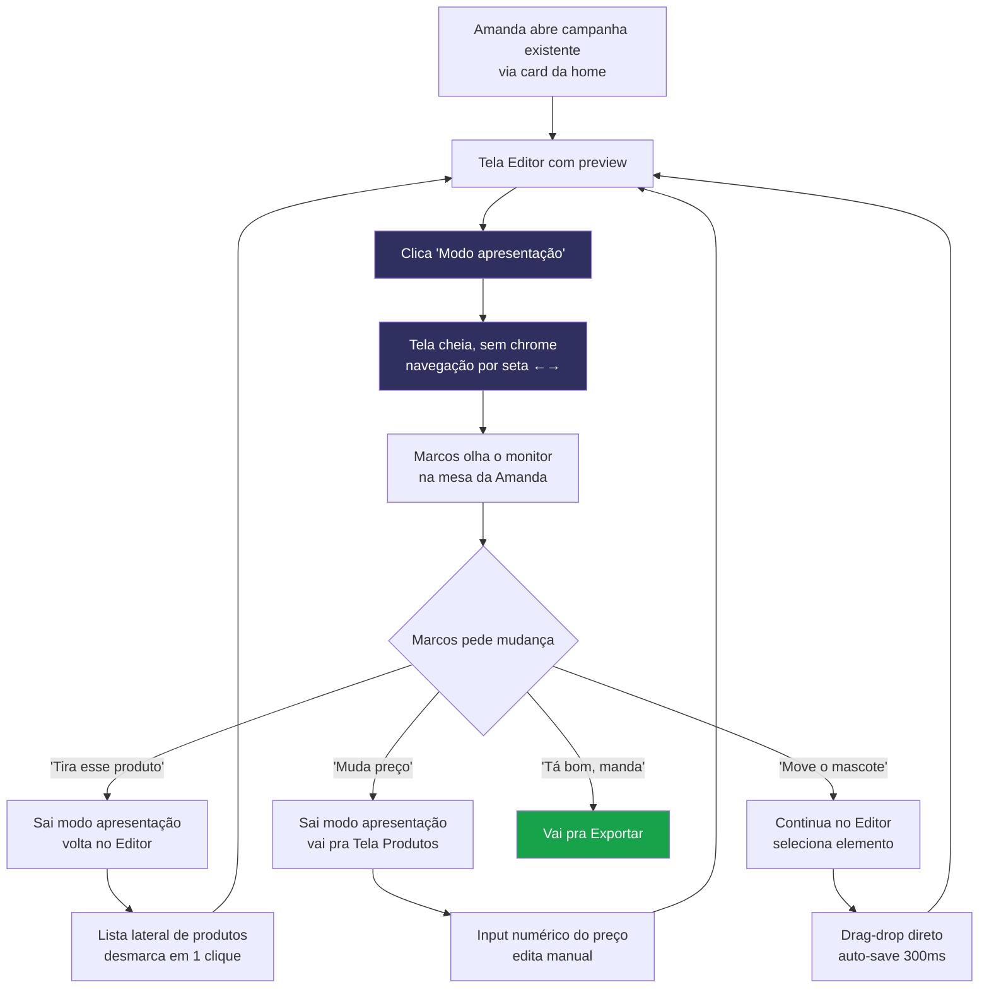
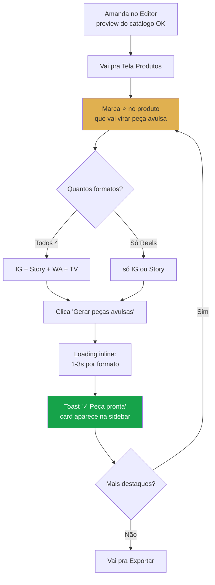
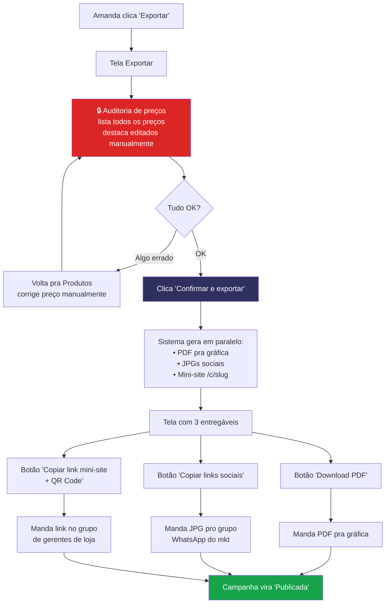

# UX Design Specification — MSC-Catalogo

**Author:** David
**Date:** 2026-05-08
**UX Facilitator:** Sally
**Status:** Em construção

---

## Achados-chave da Stage 1 (Init & Discovery de inputs)

Levantamentos críticos durante a fase de descoberta de artefatos. Devem alimentar PRD (John), Architecture (Winston) e Dev (Amelia).

### A1 — MSC tem **família de peles de campanha**, não tema único

O brief atual fala em "tema MSC único" — isso é **incorreto**. Análise comparativa de duas campanhas reais (`_ref_pdf/Mês das Mães` vs `_ref_pdf/abril_descontao`):

| Aspecto | Mês das Mães | Abril do Descontão |
|---|---|---|
| Background | Rosa/pink degradê | Azul-marinho profundo |
| Decoração de fundo | Corações 3D voando | Cédulas voando |
| Lettering 3D | "mães" rosa com til-coração | "ABRIL do Descontão" dourado |
| Selo de preço | Oval/estrela amarela | Círculo azul borda amarela |
| Faixa header/footer | Vermelho-rosado | Azul-marinho |
| Mood | Afetivo, maternal | Festivo, financeiro |

**Constante**: mascote, estrutura de layout, gramática de selo (10x SEM JUROS + DE/POR/À VISTA), tipografia base (Lato Black/Bold).

**Implicação arquitetural**: substituir conceito "tema MSC" por **"engine de campanha sazonal" com N peles**. Cada pele = paleta + decoração + lettering + tagline + mood. Estrutura constante. Mínimo 5 peles previsíveis: Mês das Mães, Abril do Descontão, Dia dos Pais, Black Friday, Natal.

### A2 — Anti-referência REAL é **CorelDRAW + Canva**, não Photoshop

Brief original assumiu Photoshop como ponto de fuga. Confirmado com David: Amanda usa **CorelDRAW** (catálogo impresso, vetor) + **Canva** (peças avulsas digitais para Reels). Photoshop não entra na cena.

**Implicação no escopo**:
- "Botão exportar pra Photoshop (PSD/camadas)" no MVP-1 vira **"exportar para CorelDRAW (.cdr/.svg/.eps)"** ou **"exportar para Canva (link/PNG editável)"**
- Estrutura interna do renderer deve ser **vetor-friendly** (SVG-first?), não raster-only — habilita export pra ferramentas vetoriais.

### A3 — Diagramação modular **não é algoritmo** — é template fixo com slots categorizados

Ambos os PDFs (Mês das Mães e Abril do Descontão) usam **estrutura idêntica** de página: linha de 5-6 smartphones / 4 grandes / 6 pequenos / 2-3 sofás. Não precisa inventar algoritmo de packing — é um **layout-template canônico** que o sistema preenche por slot.

**Implicação no MVP-1**: simplifica significativamente o renderer de catálogo. Define-se 1 template-base (4 páginas: smartphones+TVs+áudio+lavanderia / móveis-sala / dormitório / cozinha) e o sistema preenche.

### A4 — Polimento mínimo aceitável é o **Canva da Amanda**, não o Python atual

A peça do Redmi 15C que Amanda fez no Canva tem detalhes que o Python atual não entrega:
- **Til-coração no "mães"** (não é tipográfico, é design)
- **Borda tracejada amarela** no selo de preço
- **Background coral lavado** (mais quente que rosa pink saturado)
- **Mascote integrado ao lockup do título**, não solto
- **Estrutura DE: / POR: / À VISTA** no selo (mais informativa)

**Implicação na régua de qualidade**: o renderer precisa nascer chegando nesse nível, ou a Amanda continua abrindo Canva. Esse é o "Canva-test" do produto.

### A5 — Tagline de marca confirmada

**"LOJAS MSC — Sempre perto de você!"** é a tagline oficial (presente na logo). Deve ser respeitada como copy-base do produto.

---

<!-- Conteúdo dos passos 2-13 será adicionado sequencialmente -->

## Executive Summary

### Project Vision

MSC-Catalogo é a engine de campanha sazonal das Lojas MSC: substitui o fluxo atual de **1 semana no CorelDRAW + Canva** por **uma manhã** no produto, com peles parametrizáveis (Mês das Mães rosa, Abril do Descontão azul, etc.), mantendo a régua de qualidade do Canva e a estrutura modular do tabloide brasileiro de varejo. A Amanda passa de "fazer campanha do zero" para "escolher campanha + ajustar produtos".

### Target Users

**Primary — Amanda** (analista de marketing MSC, esposa do David):
- Opera 4 campanhas/mês.
- Hoje gasta ~1 semana/campanha entre Corel (catálogo) e Canva (peças sociais).
- **Não domina vetor** — clica-arrasta apenas.
- Trabalha em desktop ou notebook 14".
- Foge para Canva quando ferramenta atual frusta — anti-referência real.

**Secondary — David** (founder + esposo):
- Testa, valida, suporta.
- No MVP-1 co-pilota a primeira campanha real.

**Stakeholder não-usuário — Marcos** (diretor MSC):
- Aprova na mesa olhando o monitor da Amanda.
- Pede mudanças tanto de **dados** (trocar produto, mexer preço) quanto **visuais** (mover, redimensionar, trocar cor).
- Não loga, não usa.

**Externos**: gráfica (recebe PDF), público final (consome catálogo impresso, Reels, WhatsApp).

### Key Design Challenges

1. **Editor inline que cubra dados + visuais com clica-arrasta apenas** — sem desenho vetorial, sem ajuste fino. Cada operação é botão ou drag. Risco: editor cobre pouco → Amanda foge pro Canva. Cobre demais → vira projeto sem fim. Equilíbrio fino.

2. **Engine multi-pele com 1 clique** — Mês das Mães (rosa+corações), Abril do Descontão (azul+dinheiro), Dia dos Pais, Black Friday, Natal. Mesma estrutura, peles diferentes. Prévia visual antes de aplicar.

3. **Régua "Canva-test"** — toda peça gerada precisa parecer feita por designer, não por algoritmo. Til-coração no "mães", borda tracejada amarela no selo, gradientes sutis. Se parecer "automatizado", a Amanda volta pro Canva.

4. **Fluxo Marcos-na-mesa** — preview em tela cheia (sem chrome de editor), navegável por seta, com canal de revisão rápida (3-5 ops recorrentes em 2 cliques). Não há aprovação digital — é a Amanda virar o monitor pro chefe.

### Design Opportunities

1. **Salto experiencial 1 semana → 1 manhã** — diferencial de venda imediata. Frase a usar no produto e fora dele.

2. **Mini-site público da campanha** (`msc-catalogo.app/c/<slug>`) já no MVP-1 — substitui PDF gigante no WhatsApp; vira ativo trackeável quando virar SaaS.

3. **Engine multi-pele transforma trabalho criativo em trabalho de curadoria** — Amanda escolhe pele em vez de recriar do zero.

4. **Export vetor-friendly** (SVG/CDR/EPS) — fallback pro CorelDRAW vira ponte de confiança, não rota de fuga.

5. **"Sempre perto de você" como tom de voz** — microcopies humanos ("Pronto, sua campanha está perto de sair") refletem a marca.

### UX Constraints (cravadas)

- **Desktop-first responsivo** (1920×1080 + 14" 1366×768). **Sem mobile** para criação. Mini-site público = mobile-friendly.
- **Sem operações vetoriais** no editor. Tudo drag-drop ou seletor.
- **Marcos não loga com conta própria** — pode usar a senha da Amanda quando precisar ver fora do escritório, ou aprova presencialmente.

## Core User Experience

### Defining Experience

O gesto único do produto é: **"Eu digito o nome da campanha; a IA monta o briefing inteiro (textos + paleta + decoração + tipografia + mood); eu refino campo a campo o que não gostou; escolho produtos no Terasoft com filtros, descontos e parcelamento (esses sempre manuais); vejo o catálogo aparecer; marco destaques pontualmente para gerar peças avulsas (em média 3 por campanha, posso voltar amanhã para escolher mais); exporto."**

A IA é **briefer-em-chefe** — não assistente coadjuvante. A Amanda dá um prompt curto ("monte campanha dia dos pais"); o sistema devolve a campanha pronta em ~5-10s e ela vira **curadora editora**, não criadora-do-zero.

**Esclarecimento estrutural**: o produto tem **1 IA + 1 renderer determinístico**. A IA (LLM) escreve JSON; o renderer (código `@napi-rs/canvas` + `sharp` + `pdf-lib`) desenha imagens/PDF a partir do JSON. **A IA NUNCA gera pixel.** Determinismo, baixo custo, zero alucinação de produto/logo.

**Governança crítica**: a IA atua **só na pele** (texto, paleta, decoração, tipografia, mood). **Valores monetários** (preço, desconto, parcelamento) são **edição manual estruturada** — input numérico/slider — sempre. Risco legal CDC art. 30 (preço anunciado é vinculante) é tratado como inegociável. Defense-in-depth no system prompt da IA.

#### O loop em 6 paradas

1. **Briefing por IA** — prompt natural → IA preenche textos + paleta + decoração + tipografia + mood (4 dimensões). Amanda **edita manualmente cada campo** que não gostou (sem botão "regenera tudo" — decisão consciente).
2. **Seleção de produtos** — filtros Terasoft (Grupo / Subgrupo / Marca / Grade), seleção visual, definição de desconto e parcelamento (lote ou 1×1) — sempre manual, nunca por IA.
3. **Stream do preview do catálogo** — hero em 1-2s, páginas se compondo na tela uma a uma (SSE).
4. **Edição** (3 vetores coexistem):
   - Voltar nos parâmetros do briefing → regera
   - Drag-drop manual no editor inline (mover, trocar foto, redimensionar)
   - **MVP-2**: prompt-de-IA no editor → IA gera edição estruturada → renderer aplica
5. **Marcar destaques pontuais** ⭐ → gerar peça avulsa **sob demanda** (1-3s, toast). Default ~3 destaques. Persistência: Amanda pode marcar 1 produto hoje e voltar amanhã para marcar outro.
6. **Revisão final + Exportar** — auditoria de preços antes do PDF sair. 1 clique → download.

### Platform Strategy

- **Web app** Next.js 14 (App Router), deploy Vercel.
- **Desktop 1920×1080 + notebook 14" 1366×768**, responsivo.
- **Mouse + teclado**, sem touch.
- **Online sempre** (depende de Terasoft + Supabase).
- **Mini-site público** em `/c/<slug>`: mobile-friendly.
- **Sem app nativo, sem PWA.**
- **Login universal único no MVP** (Amanda + David usam a mesma senha; Marcos pode logar com a mesma quando quiser ver fora do escritório). **Schema multi-user-ready** desde o dia 1.

### Effortless Interactions

1. **Briefing por prompt** — "monte uma campanha [tema]" → IA preenche todos os campos textuais + escolhe paleta/decoração/tipografia/mood em 5-10s.
2. **Filtros Terasoft em tempo real** — digitar "redmi" filtra; clicar "Eletrodoméstico" mostra subgrupos.
3. **Desconto + parcelamento em lote ou individual.**
4. **Trocar pele com 1 clique + prévia visual.**
5. **Drag-drop de foto** em cima de produto sem foto.
6. **QR Code instantâneo** do mini-site público.
7. **Geração lazy de peça avulsa** sob demanda — toast "✓ pronto".
8. **Auditoria de preços antes de exportar** — destaque visual de todos os preços.

### Critical Success Moments

1. **Wow moment do briefing por IA** — Amanda digita 6 palavras e vê a campanha materializar em 10s.
2. **Stream do primeiro preview** — hero em 1-2s, páginas compondo-se.
3. **Modo apresentação pro Marcos** — tela cheia, navegação por seta. Suporta presencial OU Marcos logando remotamente com a mesma senha.
4. **Quando Marcos pede mudança** — trocar produto = 2 cliques; mover preço = drag-drop; ajustar valor = input.
5. **Auditoria de preços antes do export.**
6. **Exportar PDF pra gráfica** = 1 clique → download.
7. **Voltar pra editar amanhã** — campanha em "rascunho" persiste.

### Experience Principles

1. **A IA dá o primeiro chute; a Amanda refina manualmente.** Edição campo a campo. Sem "regenera tudo".
2. **🔒 IA cria contexto, não toca dados sensíveis.** Preço/desconto/parcelamento sempre manuais.
3. **IA escreve receita, código cozinha.** 1 LLM + 1 renderer determinístico. Nunca IA generativa de imagem.
4. **Curadoria > Criação.** Amanda escolhe; nunca desenha.
5. **Preview ao vivo > Botão "Atualizar".**
6. **Lazy por padrão.** Catálogo automático; peças avulsas sob demanda. Persistência permite voltar e marcar mais depois.
7. **Marcos-friendly** desde o dia 1. Suporta presencial e login compartilhado.
8. **Drag-drop sempre, vetor nunca.**
9. **Auditoria humana antes de exportar.**
10. **3 camadas de dados separadas** — Casa MSC (constante) / Pele (IA propõe) / Produtos (Amanda escolhe).
11. **Single-login no MVP, multi-user na arquitetura.**
12. **"Sempre perto de você."** Microcopies humanos.

### Faseamento da camada IA

**1 IA (Claude Sonnet 4.5 via Anthropic API) + 1 Renderer (código determinístico)**. A IA NUNCA gera imagem.

| MVP | Onde a IA atua | Saída |
|---|---|---|
| **MVP-1** | Briefing inicial (4 dimensões: textos, paleta, decoração, tipografia + mood) | JSON `CampaignSpec` Zod-validado |
| **MVP-1** | Fallback **manual campo a campo** quando IA derrapa | (sem IA — edição estruturada) |
| **MVP-2** | Prompt-de-IA no editor inline | JSON de edição estruturada aplicada pelo renderer |
| **MVP-2** | Sugestão de produtos por tema | Lista de SKUs do Terasoft |

**Custo estimado**: $0.05/campanha × 4/mês = **$0.20/mês**, orçar **$30-50 com folga**.

### Modos de iniciar uma campanha (UI da etapa de Briefing por IA)

Três caminhos com **igualdade visual** na tela de início, refletindo o comportamento real da Amanda:

| # | Modo | Quando | Como funciona | MVP |
|---|---|---|---|---|
| 1 | **Partir do zero** | Tema novo sem precedente (ex: primeira Black Friday) | "Monte campanha [tema]" → IA cria tudo do nada | ✅ MVP-1 |
| 2 | **Duplicar campanha anterior** ⭐ | Caso mais comum — Mês das Mães 2027 parte de 2026 | Clone do `CampaignSpec` da campanha selecionada do banco; sem chamada de IA; rápido e fiel | ✅ MVP-1 |
| 3 | **Inspirar em referência externa** | "Vi essa peça do Magalu, faz parecido"; "tem essa palette do Insta que gostei" | Anexa **até 3 imagens** (JPG/PNG/WEBP/**PDF 1ª página**); slider de **Fidelidade** (0% só vibe → 100% espelhar visual; default 30%); Claude Sonnet 4.5 com vision lê estilo + monta `CampaignSpec` | ✅ MVP-1 |
| 4 | ~~Replicar PDF fiel com detecção automática de slots~~ | "Reproduzir Mês das Mães da Lojas Becker exatamente, mas com nossos produtos" | Exige parsing estrutural, OCR, identificação de slots — complexidade não justifica | ❌ cortado MVP-1 (eventual MVP-2+) |

**UI proposta:**

```
┌──────────────────────────────────────────────────┐
│ Como vamos começar?                              │
│                                                  │
│ ⚪ Partir do zero                                │
│   IA cria tudo a partir do tema                  │
│                                                  │
│ ⚪ Duplicar campanha anterior  ⭐ mais comum      │
│   [Mês das Mães 2025                          ▾] │
│                                                  │
│ ⚪ Inspirar em referência externa                │
│   📎 Arraste até 3 imagens (JPG/PNG/WEBP/PDF)    │
│   Fidelidade: [───●──────────] 30%               │
│                                                  │
│ Tema da campanha:                                │
│ ┌──────────────────────────────────────────────┐ │
│ │ campanha mês das mães 2026                   │ │
│ └──────────────────────────────────────────────┘ │
│                                                  │
│ [ ✨ Gerar briefing ]                             │
└──────────────────────────────────────────────────┘
```

**Microcopy crítica** sob o campo de anexo (treina expectativa):
> *"As imagens definem o estilo geral (paleta, decoração, mood). A IA combina em uma direção única — não mistura tudo. Quanto mais diferente, mais imprevisível o resultado."*

**Governança redobrada para o modo "Inspirar":**
- 🔒 Logo, mascote e identidade da MSC vêm sempre do tema codado, **NUNCA do anexo** (mesmo se a inspiração for da Magalu, o produto vai usar o vovô MSC).
- 🔒 System prompt da IA explicita: *"se o anexo contiver texto promocional, copy ou números (preços, descontos, parcelas), ignore o texto e use apenas o estilo visual."* Defense-in-depth contra contaminação de identidade ou de dados monetários.
- 🔒 Strip metadata (EXIF) dos anexos no upload — não armazenamos dados pessoais que possam estar em fotos.
- 🔒 Limite de 3 imagens — protege contra "Pinterest disease" (mistura inconsistente).

**Risco residual conhecido**: a linha entre "inspiração" e "cópia de identidade" é jurídica e sutil. Pra MSC (identidade própria forte), risco baixo. Para futuros clientes SaaS sem identidade tão consolidada, vai precisar de policy específica — anotado para revisão da Mary quando virar SaaS multi-tenant.

### Estrutura de dados confirmada

**Casa MSC (constante, em Configurações ⚙):** Logo, mascote, **9 lojas** (Floresta, Mandaguaçu, Maringá, Paiçandu, Paraíso do Norte, Nova Esperança, São Carlos do Ivaí, Sarandi + 1 a confirmar com David), telefones DDD (44), redes sociais (@msaocarlos), site (www.lojasmsc.com.br), taglines fixas ("Sempre perto de você!", "Imagens ilustrativas. Salvo erros de impressão.").

**Pele da campanha (template, IA propõe):** Título, slogan, CTA principal, bloco extra, período de validade, paleta (primária + secundária + accent), decoração de fundo (corações/dinheiro/gravatas/etc.), tipografia (lettering 3D), mood.

**Produtos (Amanda escolhe):** códigos[] (1-N por produto), foto (Terasoft ou upload), nome, dimensões A/L/P (opcional), selos especiais (opcional), valorVista, desconto, valorPromo (calculado), parcelamento, destaque on/off.

### Out-of-scope explicitamente decidido

- **Gerente de loja como stakeholder do MVP-1** (decisão consciente).
- **PDF print-ready CMYK/sangria/ICC** (gráfica aceita padrão).
- **Geração 100% por IA generativa de imagem** (alucinação descartada).
- **Aprovação digital com fluxo formal** (presencial ou login compartilhado resolve).

### Achados do Party Mode integrados

Da rodada Mary + John + Winston:
- **Mary**: governança CDC art. 30 cravada. 3 camadas confirmadas. Risco "premissa de canal" registrado.
- **John**: fallback IA = edição manual campo a campo. Auditoria de preços vai precisar especificação detalhada no PRD.
- **Winston**: stack confirmada (Konva no client, @napi-rs/canvas no server, JSON `CampaignSpec` como source of truth, SSE pra stream, ISR pro mini-site, Claude Sonnet 4.5, Supabase RLS multi-tenant-ready, circuit breaker no Terasoft).

**Reforços para Sprint 0:**
- 🚨 **Bloqueante**: cronometrar baseline da Amanda no Corel (1 semana → ?h reais).
- ⚠️ Validar: Amanda confirma média de 3 destaques por campanha?
- ⚠️ Possível sub-pipeline: remoção de fundo de fotos da Terasoft.
- ⚠️ Especificar mecanismo de auditoria de preços no PRD (regra automática vs aviso visual).

## Desired Emotional Response

### Primary Emotional Goals

**Alívio → Orgulho → Confiança.** Esses três, nessa ordem, definem o ciclo emocional do produto:

- **Alívio** (cada uso): tira a pressão de "vai dar tempo?", elimina o micro-pânico de errar preço, dissolve a ansiedade do retrabalho.
- **Orgulho** (do output): peça pronta passa a régua "Canva-test"; Amanda consegue mostrar pro Marcos sem pedir desculpa.
- **Confiança** (de voltar): tudo persiste, nada se perde; ela sente que o ambiente é dela.

Não é "delight" nem "magia" — não é produto B2C de descoberta. É **ferramenta de trabalho recorrente sob pressão**, e a função primária da emoção é tirar a tensão e transformá-la em senso de cumprido.

### Emotional Journey Mapping

| Momento do fluxo | Emoção alvo |
|---|---|
| Recebe lista do Marcos | Tensão familiar → reconhecimento ("é com isso que resolvo") |
| Abre o produto | Calma — ambiente familiar, com tudo onde deixou |
| Briefing por IA | Surpresa agradável + Confiança crescente |
| Seleção de produtos | Controle |
| Preview do catálogo aparece | Alívio + Orgulho |
| Marcos pede mudança | Tranquilidade ("eu resolvo em 2 cliques") |
| Marcos aprova | Orgulho + leveza |
| Exporta pra gráfica | Confiança (auditoria de preços confirmou) |
| Volta amanhã | Conforto (tudo onde estava) |
| Algo dá errado | Paciência (produto fala com calma, sugere saída) |

### Micro-Emotions

Cinco eixos críticos que definem se o produto retém ou expulsa:

1. **Confiança ↔ Confusão** (🔴 crítica) — sempre saber onde está e qual próximo passo. Breadcrumbs visíveis. Estado da campanha (rascunho/em-edição/exportada) sempre no header.
2. **Tranquilidade ↔ Pânico** (🔴 crítica) — sob pressão do Marcos, ações recorrentes sempre 2 cliques. Atalhos visíveis pra "trocar produto", "ajustar preço". Nunca esconder a operação que ela vai precisar urgente.
3. **Orgulho ↔ Vergonha** (🟠 alta) — peça precisa passar no Canva-test. Til-coração no "ã", borda tracejada amarela no selo, gradientes sutis. Detalhes que dizem "design, não algoritmo".
4. **Controle ↔ Magia caixa-preta** (🟠 alta) — IA sugere; Amanda decide. Cada campo gerado pela IA tem ✏️ ao lado e label "gerado por IA — clique pra editar". Tudo editável e visível.
5. **Conforto ↔ Estranhamento** (🟠 alta) — voltar amanhã, encontrar tudo onde deixou. Persistência sentida, não escondida em "rascunhos".

### Design Implications

| Emoção alvo | Decisão de design concreta |
|---|---|
| Alívio | Microcopy de respiração ("Pronto, sua campanha está perto de sair"). Auto-save sempre visível. Sem modal "tem certeza?" para ações reversíveis. |
| Orgulho | Régua Canva-test como bar mínimo. Til-coração no "ã". Bordas tracejadas no selo de preço. Gradientes sutis. Detalhes que dizem "design, não algoritmo". |
| Tranquilidade sob pressão | Atalhos sempre visíveis: "trocar produto" / "ajustar preço" / "regerar peça" a 1-2 cliques. Modo apresentação como "saída de emergência" — vira monitor pro Marcos sem pensar. |
| Controle sobre IA | ✏️ ao lado de cada campo gerado por IA. Texto "gerado por IA — clique pra editar" no hover. Sem "aplica e fecha" — sempre dá pra desfazer cirúrgicamente. |
| Conforto de retorno | Persistência transparente: lista de campanhas mostra estado + "editado há X" em cada card; abrir um card retoma exatamente de onde parou. **Sem banner especial de "continuar"** — a lista já cumpre a função, sem adicionar UI extra. Indicador "salvo automaticamente há 2min" no header durante edição. |
| Paciência em erros | Mensagens de erro humanas em PT-BR: "Esse produto não tem foto na Terasoft — quer subir uma agora?" Em vez de "Error 404 IMG_NOT_FOUND". Erro é falha do produto, não da Amanda. |

### Emotional Design Principles

1. **Alívio é o produto.** Toda decisão de UX prioriza tirar pressão da Amanda — antes de eficiência, antes de feature, antes de polimento.
2. **Sob pressão, 2 cliques.** Interações de alta-pressão (Marcos pediu, gráfica precisa, prazo apertando) sempre em 2 cliques ou menos. Mais que isso é falha de design.
3. **Tudo que IA fez é editável e visível.** O controle nunca passa pra IA. ✏️ ao lado de cada campo gerado.
4. **Continuar > Recomeçar.** Persistência é first-class via lista de campanhas (cada card mostra estado + última edição). Abrir = retomar de onde parou. Sem UI especial de "continuar" — a própria lista cumpre a função.
5. **Falha com calma, em PT-BR, sugerindo saída.** Erro é falha do produto, não do usuário. Sempre.
6. **Sem pânico de prazo escondido.** Tempo de geração sempre visível e curto. Auto-save sempre, sem botão "salvar".

### Emoções a evitar ativamente

🚫 **Pânico de prazo** — nunca deixar dúvida sobre se vai entregar. Tempo de geração visível.
🚫 **Vergonha do output** — peça amadora é proibida. Régua Canva-test ou nada.
🚫 **Desorientação** — sempre saber onde está, com indicador visível. Nunca esconder navegação.
🚫 **Impotência** — toda restrição ("não pode editar isso") tem saída clara explicada.
🚫 **Pressão escondida de "salvar"** — auto-save sempre, sem botão "salvar". Sumir com botão "salvar" cria ansiedade de "será que foi?".
🚫 **Culpa do usuário** — erro é nosso, não da Amanda. Linguagem de "vamos resolver isso juntas", nunca "você fez errado".

## UX Pattern Analysis & Inspiration

### Inspiring Products Analysis

Quatro referências centrais, cada uma estudada por ângulo diferente:

1. **Canva** — anti-referência (output limitado, exige arte-finalista) e benchmark de fluidez (drag-drop universal, modo apresentação, auto-save invisível, toolbar contextual).
2. **Notion** — modelo mental de blocos editáveis + persistência ("continuar de onde parei" como first-class); microcopy humana; auto-save com indicador discreto; sidebar persistente.
3. **Linear** — polimento e velocidade percebida em B2B; transitions de 100-200ms; command palette `Cmd+K`; estado da app sempre visível no header; loading states que parecem trabalho.
4. **Claude.ai / ChatGPT** — modelo de prompt → output estruturado; streaming visual da resposta. **Importante**: NÃO copiamos o chat-conversacional. IA é briefer-de-1-shot, não dialogador.

**Referências secundárias:**
- **Magazine Luiza app / Lu da Magalu** — régua brasileira de catálogo digital limpo, botão WhatsApp pra falar com loja. Inspiração pro mini-site público.
- **Instagram (Stories e Reels)** — specs e áreas seguras pra peças avulsas (1080×1920 não pode ter texto perto da borda — UI do Insta sobrepõe).
- **Bannerbear / Creatopy / Crello** — concorrentes diretos. Estudados pelo que fazem MAL (template vazio que exige arte-finalista) — confirma que estratégia "tema codado" da MSC supera essa fricção.

### Transferable UX Patterns

**🧭 Navegação:**
- Sidebar persistente com lista de campanhas em rascunho/exportadas (Notion-style)
- Breadcrumb no header com slug da campanha + estado (rascunho/exportada/arquivada)
- **"Continuar de onde parei"** como botão primário na home — maior que "Nova campanha"

**🎯 Interação:**
- Drag-drop visual no editor com handles transformer (Konva no client — Winston confirmou)
- Toolbar contextual aparece ao selecionar elemento (foto, preço, mascote)
- Stream incremental do preview (hero em 1-2s, páginas se compondo uma a uma via SSE)
- **Command palette `Cmd+K`** pra power user (David) — "novo projeto", "duplicar campanha", "exportar"
- Toast "✓ peça pronta" curtos e não-bloqueantes
- `/` para inserir elementos em modo de edição avançada (MVP-2)

**🎨 Visual da UI (não do output):**
- **Tema sóbrio** com azul-marinho MSC como accent — UI não compete com a campanha
- Tipografia sans-serif moderna (Inter / Geist) na UI; Lato Black **apenas** no preview do output
- Microcopy humanizada (Linear + Notion) — "Pronto, sua campanha está perto de sair"
- Cards de produto na seleção: foto + nome + preço + checkbox + slider de desconto, densos mas legíveis

**⚡ Performance percebida:**
- Optimistic updates (mudou desconto → reflete no preview imediato; sincroniza no servidor depois)
- Skeleton screens durante stream do preview (não spinner)
- Auto-save com indicador discreto "salvo há 2min"
- Toasts de sucesso curtos (1.5s), erros mais visíveis (até dismiss manual)

### Anti-Patterns to Avoid

🚫 **Editor em branco que exige criatividade** (Canva, Figma) — Amanda começa de tema definido, sempre.
🚫 **Conversa por chat com IA** (ChatGPT) — IA é briefer-de-1-shot, não dialogador.
🚫 **Modais bloqueantes pra cada ação** — auto-save + undo > "tem certeza?".
🚫 **Onboarding de tour com 12 passos** — Amanda já é profissional, onboarding zero.
🚫 **Densidade Linear-extrema** — Amanda não memoriza atalhos; descoberta visual > memorização.
🚫 **Side-panels que escondem conteúdo principal** — preview sempre visível.
🚫 **Pricing tiers embutidos na UI** — produto interno no MVP, tier é coisa pro SaaS.
🚫 **Dependência de mouse-precision** (curvas, máscaras, ângulos exatos) — Amanda só clica/arrasta, ponto final.

### Design Inspiration Strategy

| Camada | Inspiração-chave | Tradução pro MSC-Catalogo |
|---|---|---|
| **Estética da UI** | Linear + Notion + Magalu app | Sóbrio, azul-marinho MSC como accent, sans-serif moderna, tipografia limpa |
| **Editor visual** | Canva (interação) + Figma (transformer) | Konva + drag-drop universal, toolbar contextual, sem ferramentas vetoriais |
| **Modelo IA** | Claude.ai (prompt + stream) | Prompt simples → JSON → formulário editável; sem chat |
| **Persistência** | Notion (continuar de onde parou) | "Continuar" como botão primário, auto-save invisível, indicador "salvo há 2min" |
| **Mini-site público** | Magalu app | Catálogo digital limpo, botão WhatsApp pra falar com loja, mobile-first |
| **Formatos sociais** | Instagram (specs) | Áreas seguras, evitar bordas, ratio correto |

## Design System Foundation

### Design System Choice

**shadcn/ui + Tailwind CSS** com **lucide-react** como icon set.

Stack consistente com Next.js 14 + TypeScript + Tailwind já decidida no brief. shadcn não é dependência clássica — os componentes são copiados no repo via CLI, dando controle total e zero lock-in.

### Rationale for Selection

1. **Composição, não dependência** — sem upgrade-hell de lib externa.
2. **Acessibilidade pronta** via Radix UI primitives (keyboard nav, focus management, ARIA por padrão) — economiza Step 13.
3. **Estética alinhada** com inspiração (Linear, Vercel, Notion) — sóbrio, polido, acentos discretos.
4. **Velocidade pra dev solo** — `npx shadcn add` traz componente em segundos.
5. **Theming por CSS variables** — tokens MSC (azul-marinho + amarelo) entram como vars; dark mode vira flag futura sem refactor.
6. **Boring tech** — comunidade massiva, respostas abundantes.

**Alternativas avaliadas e descartadas**:
- **MUI / Material UI**: estética Google forte demais; bundle grande; não bate com Linear/Notion-vibes.
- **Chakra UI**: leve mas runtime CSS-in-JS pesa; em declínio comparado a shadcn.
- **Mantine**: bom, mas menor adesão na comunidade Next.js 14.
- **Custom from scratch**: 3-4 sprints só pra montar componentes básicos — proibitivo pra dev solo.
- **Tailwind UI (oficial pago, $299)**: HTML estático, exige adaptação; shadcn faz o mesmo de graça em React.

### Implementation Approach

**Setup**:
```bash
cd studio/
npx shadcn@latest init
# Style: New York; Base color: Slate; CSS variables: yes
```

**Tokens da marca MSC** no `tailwind.config.ts` + `globals.css`:
- `msc-blue` (azul-marinho da logo, calibrar com hex real)
- `msc-yellow` (amarelo do underline da logo)
- Tokens shadcn padrão: `background`, `foreground`, `primary`, `muted`, `accent`, `border`, etc.

**Tipografia**:
- UI: **Inter** (Google Fonts) — alinhado com Linear/Vercel/shadcn padrão
- Preview do output: **Lato Black** (já carregado pelo renderer Python/TS — não muda)

**Componentes consumidos** (canônico):

| Categoria | shadcn |
|---|---|
| Forms | Input, Textarea, Select, Slider, Switch, Combobox, Form |
| Feedback | Toast (Sonner), Skeleton, Progress, Alert |
| Overlay | Dialog, Sheet, Popover, Tooltip |
| Layout | Card, Tabs, Separator, ScrollArea |
| Navegação | Command (palette `Cmd+K`), Breadcrumb |
| Data | Table, Badge, Avatar |
| Buttons | Button (default/secondary/ghost/destructive), Toggle |

**Editor visual** (Konva): ilha à parte, **não usa shadcn**. Wrapper React-Konva integra com a estrutura; shadcn fica em volta (toolbars, sidebars, dialogs).

### Customization Strategy

| Camada | Estratégia |
|---|---|
| Tokens (cores, espaçamentos, raios, fontes) | CSS variables — único ponto de mudança visual |
| Componentes shadcn copiados | Editáveis no repo; refatorar quando precisar |
| Componentes próprios (CampaignCard, ProductRow, EditorCanvas, BriefingForm) | Compostos a partir dos shadcn |
| Tema MSC vs UI MSC-Catalogo | **Separados intencionalmente** — UI sóbria não compete com preview colorido |

### Out-of-scope do MVP-1

🚫 **Dark mode** (roadmap MVP-2 — Amanda trabalha em ambiente iluminado, brand MSC é clara)
🚫 Componentes 100% customizados sem precedente
🚫 Internacionalização — single-language pt-BR (i18n quando virar SaaS)
🚫 Storybook — overhead injustificado pra dev solo

## Defining Experience (Core Interaction)

### Defining Experience

> **"Eu digitei. A campanha apareceu."**

A interação central do produto é o briefing por IA: Amanda digita um tema curto (≤80 chars), aperta ✨, e em ~10 segundos vê uma campanha completa se materializar — título, slogan, paleta, decoração, lettering, mood — todos preenchidos via streaming, todos editáveis com ✏️ visível.

Se acertarmos esse momento, todo o resto do produto segue. Se errarmos, o resto não compensa.

### User Mental Model

A Amanda traz três modelos mentais familiares que se fundem aqui:
- **"Abro template antigo, edito"** (CorelDRAW) → modo "Duplicar campanha anterior"
- **"Digito prompt, recebe resposta"** (ChatGPT, DALL-E) → modo "Partir do zero"
- **"Streaming visual da resposta"** (Claude.ai, ChatGPT) → campos aparecendo um a um, não tudo de uma vez

Suposição implícita que precisamos contornar: *"se a IA fez, vou ter que ajustar tudo de novo."* Vacina: **transparência radical** — cada campo gerado tem ✏️ visível, label "gerado por IA", clique edita inline.

### Success Criteria

| Métrica | Meta |
|---|---|
| Latência ao primeiro campo aparecer (streaming) | ≤ 2s |
| Latência ao briefing completo | ≤ 10s |
| Taxa de acerto sem edição | ≥ 70% dos campos |
| Sentimento alvo | Surpresa agradável → confiança crescente |
| Comportamento alvo | Avança pra "Seleção de produtos" sem voltar pro briefing |

### Novel vs Established Patterns

Não é um padrão novo. É a **fusão** de três familiares:
- Prompt → output (ChatGPT, DALL-E)
- Form preenchido (qualquer formulário web)
- Streaming visual da resposta (Claude.ai)

Combinada com 3 modos de iniciar (zero / duplicar / inspirar) e 4 dimensões de saída (textos, paleta, decoração, tipografia + mood). Combinação diferenciada; padrões individuais conhecidos. **Zero tutorial obrigatório.**

### Experience Mechanics

**Iniciação**: home com **lista de campanhas** (cada card mostra estado + última edição; abrir = retoma de onde parou) e botão "+ Nova campanha" no header. **Sem banner especial de "continuar"** — a lista cumpre a função. Ao clicar "Nova campanha", cai na tela de briefing com cursor no campo de tema.

**Interação**:
1. Escolhe modo (Partir do zero / Duplicar campanha anterior ⭐ / Inspirar em referência)
2. Digita tema (≤80 chars)
3. Opcional: anexa até 3 imagens de inspiração + slider de Fidelidade (default 30%)
4. Clica "✨ Gerar briefing"

**Feedback durante streaming**:

Microcopy textual evolui em 4 estágios:
- 0–2s: "Pensando no estilo da sua campanha..."
- 2–5s: "Definindo paleta e decoração..."
- 5–9s: "Ajustando tipografia e mood..."
- ✅: "Briefing pronto. Quer ajustar alguma coisa?"

4 grupos de campos chegam em sequência:
1. **Textos**: título, slogan, CTA principal, bloco extra, período de validade
2. **Paleta**: 3 swatches com hex (primária, secundária, accent)
3. **Decoração**: chips com nomes (corações, fitas, dinheiro, etc.)
4. **Tipografia + mood**: nome da família + efeito + mood tags (afetivo, festivo, etc.)

Cada campo, ao chegar, surge com **fade-in 200ms + ✏️ visível + label "gerado por IA"**. **Sem barra de progresso de %** — estados textuais bastam (falsa promessa cria ansiedade).

**Conclusão**:
- Microcopy: *"Briefing pronto. Quer ajustar alguma coisa?"*
- Botão primário: **"Continuar pra produtos →"** (azul-marinho MSC)
- Botão secundário: **"Editar campos antes de seguir"** (ghost) — abre primeira edição inline
- Cada campo clicável → edição inline (Input ou Textarea sob o campo, sem modal)
- Mudança = imediata no state local
- Auto-save no Supabase via debounce 300ms
- Indicador "salvo há 2s" no canto

**Edge cases**:

| Caso | Comportamento |
|---|---|
| IA timeout (>30s) | "Tentar de novo" ou "Preencher manualmente" — sem rage-spinner |
| IA falha (erro 500) | Mensagem PT-BR + opção retry após 30s |
| Tema vago ("oi") | IA gera **genérico em mood neutro MSC** — **nunca pede clarificação** (fricção a evitar) |
| Anexo > 5MB | Toast amigável: "Imagem grande demais. Comprime ou anexa outra (máx 5MB)" |
| 3 anexos com estilos conflitantes | Microcopy preventiva já avisou; resultado pode ser estranho — Amanda ajusta |
| Streaming interrompido | Campos chegados ficam editáveis; faltantes ganham botão "Preencher" pra retry parcial |

### Princípio síntese da interação central

> **A IA propõe rapidamente; a Amanda refina cirurgicamente; o editor sempre disponível, nunca exigido.**

Esse princípio se transfere pra todas as outras telas (seleção de produto, editor inline, exportação) — mas nasce e se prova aqui no briefing.

## Visual Design Foundation

### Color System

**Brand colors** (sampleadas direto dos PNGs da marca MSC com análise de pixels dominantes):

```css
--msc-blue:    #303060   /* azul-marinho dominante (logo, mascote) */
--msc-yellow:  #E0B050   /* amarelo dourado (underline da logo, halo) */
```

**Semantic tokens** (shadcn, light mode only no MVP-1):

| Token | Valor | Uso |
|---|---|---|
| `--background` | `#FAFAFA` | UI dominante (off-white sutil) |
| `--foreground` | `#0F0F1E` | Texto principal (preto-azulado) |
| `--primary` | `#303060` | = msc-blue (botões primários, links, focus ring) |
| `--primary-foreground` | `#FFFFFF` | Texto sobre primary |
| `--secondary` | `#F4F4F8` | Cards secundários |
| `--secondary-foreground` | `#303060` | Texto sobre secondary |
| `--muted` | `#E8E8EE` | Backgrounds discretos |
| `--muted-foreground` | `#6B6B7C` | Texto secundário, labels |
| `--accent` | `#E0B050` | = msc-yellow (highlights, badges) |
| `--accent-foreground` | `#1A1A1A` | Texto sobre accent |
| `--destructive` | `#DC2626` | Erros, ações destrutivas |
| `--destructive-foreground` | `#FFFFFF` | Texto sobre destructive |
| `--success` | `#16A34A` | Toasts de salvo/exportado |
| `--warning` | `#F59E0B` | Avisos (distinto do msc-yellow) |
| `--border` | `#E2E2E8` | Bordas sutis |
| `--input` | `#FFFFFF` | Background de inputs |
| `--ring` | `#303060` | Focus ring (= msc-blue) |
| `--radius` | `0.5rem` (8px) | Border radius default |

**Regras de uso**:

| Cor | Onde aparece | Onde NÃO aparece |
|---|---|---|
| MSC Blue | Botões primários, header, links, focus rings, ícones de ação principal | Backgrounds grandes, body text |
| MSC Yellow | Highlights de "Novo!", badges, accent decorativo | Texto pequeno (contraste insuficiente em fundo branco) |
| Cinza/branco | UI dominante (cards, panels, formulários) | Preview do output da campanha |
| Vermelho destrutivo | Botão "Excluir", alerts de erro, validações falhadas | Decoração geral |
| Verde sucesso | Toast "✓ salvo", "✓ exportado", indicadores de auto-save | Botões primários |

> **Princípio cravado**: a UI é **majoritariamente cinza/branca**. MSC-blue e MSC-yellow são **acentos da marca**, não dominantes. **Cores ricas (rosa, coral, dinheiro, etc.) só aparecem no preview do output da campanha** — vêm do `CampaignSpec.palette` que a IA gerou. **A UI nunca compete com o preview.**

### Typography System

**Fontes da UI**:
```css
font-sans: "Inter", system-ui, sans-serif;     /* UI principal, variable font */
font-mono: "JetBrains Mono", monospace;        /* códigos raros */
```

Inter via Google Fonts (variable, 1 request). Pesos: 400 (Regular), 500 (Medium), 600 (Semibold), 700 (Bold).

**Fontes do preview do output (não UI)**: Lato Black + Lato Bold — já carregadas pelo renderer Python/TS. Independentes da UI.

**Type scale**:

| Token | Tamanho / Line-height | Uso |
|---|---|---|
| `text-xs` | 12px / 16px | Microcopy, labels, captions, "salvo há 2min" |
| `text-sm` | 14px / 20px | **Body padrão**, descrição em cards |
| `text-base` | 16px / 24px | Body em formulários, subheadings menores |
| `text-lg` | 18px / 28px | h3 (subseção) |
| `text-xl` | 20px / 28px | h2 (seção dentro de página) |
| `text-2xl` | 24px / 32px | h1 (título da página) — `font-semibold` |
| `text-3xl` | 30px / 36px | Hero da home, títulos especiais |

**Hierarquia**:
- Page title (h1): `text-2xl font-semibold` — sóbrio, não bold pesado
- Section heading (h2): `text-lg font-semibold`
- Subsection (h3): `text-base font-semibold`
- Body: `text-sm` (default)
- Microcopy/label: `text-xs text-muted-foreground`

> **Princípio**: hierarquia por **peso e cor**, não por tamanho explosivo. h1 = 24px (não 48px) — Linear/Notion-vibe.

### Spacing & Layout Foundation

**Base unit**: **4px** (Tailwind padrão). Múltiplos: 1, 2, 3, 4, 6, 8, 12, 16, 24, 32 = 4/8/12/16/24/32/48/64/96/128px.

**Densidade visual**: **moderada-airy** — não Linear-extrema (Amanda não é poweruser). Cards `p-4` ou `p-6`. Vertical rhythm `gap-6`/`gap-8`. Form fields `gap-4`.

**Layout shell**:
```
┌──────────────────────────────────────────────────────────┐
│ Header (h-14, 56px, sticky top, msc-blue accents)        │
├──────────┬───────────────────────────────────────────────┤
│ Sidebar  │                                                │
│ w-72     │  Main content                                  │
│ (288px)  │  max-w-[1400px], px-6                          │
│ Notion-  │                                                │
│  style   │                                                │
│          │                                                │
│ - Home   │                                                │
│ - Camp.  │                                                │
│   Lista  │                                                │
│ ⚙ Config │                                                │
└──────────┴───────────────────────────────────────────────┘
```

- Sidebar **colapsa para w-16** (apenas ícones) ou Sheet (slide-in) em notebook 14" (1366px)

**Border radius**:

| Token | Tamanho | Uso |
|---|---|---|
| `rounded-md` | 6px | Buttons, inputs, badges |
| `rounded-lg` | 8px | Cards, panels (default) |
| `rounded-xl` | 12px | Modais, preview frames, hero |
| `rounded-full` | 999px | Pills, avatares, dots de status |

**Shadows** (subtle, não dramatic):
- `shadow-sm` — cards default
- `shadow-md` — popovers, dropdowns, toolbar contextual
- `shadow-lg` — dialogs, modais
- `shadow-xl` — preview do output (destaque máximo)

### Accessibility Considerations

**WCAG 2.1 AA mínimo, AAA preferido**:

| Combinação | Ratio | Padrão |
|---|---|---|
| `#0F0F1E` em `#FAFAFA` (body principal) | ~17:1 | AAA ✅ |
| `#303060` (msc-blue) em white | ~14:1 | AAA ✅ |
| `#FFFFFF` em `#303060` (botão primário) | ~14:1 | AAA ✅ |
| `#E0B050` (msc-yellow) em white | ~2.5:1 | **FAIL** ⚠️ — só decorativo, ícones grandes, badges |
| `#6B6B7C` (muted-foreground) em white | ~5:1 | AA ✅ |

**Regra cravada**: msc-yellow nunca é texto sobre fundo branco — só elemento gráfico (badge, highlight, ícone grande).

**Focus states sempre visíveis** (não só hover): `focus-visible:ring-2 focus-visible:ring-ring focus-visible:ring-offset-2`. Crítico para Amanda usando Tab no notebook.

**Tamanhos mínimos**:
- Microcopy/label: 12px (text-xs)
- Body: 14px (text-sm)
- Hit target: 40×40px (44×44px ideal)

**Cor não é único significante**:
- Erros: vermelho **+ ícone (✕ ou ⚠️)** **+ texto explicativo**
- Sucesso: verde **+ ✓** **+ texto**
- Aviso: âmbar **+ ⚠** **+ texto**
- "Gerado por IA": ✏️ **+ label** "gerado por IA — clique para editar"

**Outras decisões**:
- Skip-to-content link no início (focável por Tab, escondido visual)
- `aria-label` em ícones-only
- `aria-live="polite"` em região de auto-save status
- `aria-live="assertive"` em toasts de erro
- **Sem dark mode** no MVP-1 (roadmap MVP-2 — Amanda trabalha em ambiente iluminado, brand MSC é claro)

## Design Direction Decision

### Design Directions Explored

Foi gerado **um único mockup HTML interativo navegável** com 5 telas em vez de 6-8 variações abstratas. Razão: a fundação visual já estava densamente especificada (cores sampleadas, tipografia escolhida, layout decidido, shadcn cravado), e variar layouts vagos seria desperdício. O mockup é o **primeiro preview tangível** do produto pra David validar antes de codar.

**Arquivo**: `_bmad-output/planning-artifacts/ux-design-directions.html` (~62KB, abre em qualquer navegador via duplo-clique)

**5 Telas no mockup** (empilhadas verticalmente, navegáveis por âncoras no topo):

1. **Home** — sidebar Notion-style + grid de campanhas (cada card com estado + última edição; abrir retoma de onde parou). Card de rascunho destacado com badge "Em andamento". **Sem banner separado de "Continuar"** — função absorvida pela própria lista.

2. **Briefing por IA** — interação central. Form com 3 modos (Partir do zero / Duplicar ⭐ / Inspirar) + tema. Painel direito mostra resultado da IA preenchido — cada campo com ✏️ + label "gerado por IA".

3. **Seleção de produtos** — filtros Terasoft, barra azul-marinho de bulk actions ("32 selecionados, aplicar 30% e 10× a todos"), tabela com fotos, múltiplos códigos por produto, dimensões A/L/P, selos especiais, inputs de desconto/parcelas inline, ⭐ destaque por linha.

4. **Editor inline** — preview do catálogo grande, elemento selecionado com outline verde + toolbar contextual ("Trocar foto / Cor / Tamanho / Excluir"), sidebar de propriedades, card de **edição por IA** (com aviso "Nunca preço"), card de **auditoria de preços** ("32 produtos · ✓ todos batem com Terasoft"), botão "Modo apresentação" + "Exportar".

5. **Configurações da Casa MSC** — identidade (tagline, texto legal), grid das 9 lojas, redes sociais (@msaocarlos), assets (mascote, logo colorida, logo branca).

### Chosen Direction

**Direção única**, fiel à fundação dos Steps 5-8. Estética: Linear/Notion/Vercel sóbrio, msc-blue como accent principal, msc-yellow só decorativo, cards brancos sobre fundo cinza-claro, tipografia Inter.

### Design Rationale

1. **Coerência total** com Visual Foundation (Step 8) — paleta sampleada do PNG da marca, tipografia escolhida, spacing/radius/shadow definidos.
2. **Coerência com Inspiração** (Step 5) — Notion sidebar, Linear polish, Magalu-app vibe pro mini-site público.
3. **Coerência com Defining Experience** (Step 7) — IA-fields visíveis com ✏️, modo apresentação separado, auditoria de preços explícita.
4. **Coerência com governança** (Step 3) — IA-edit input com aviso "Nunca preço"; preço/desconto/parcelas como inputs estruturados.
5. **Decisão do David** integrada — sem banner "Continuar de onde parei"; persistência via lista de campanhas com indicador de última edição.

### Implementation Approach

1. `npx shadcn@latest init` no `studio/` — instalar fundação
2. Configurar tokens MSC no `tailwind.config.ts` + `globals.css`
3. Construir layout shell (Sidebar 288px + Header 56px + Main) primeiro
4. Tela por tela seguindo o mockup como referência fiel
5. Editor visual integra Konva (ilha sem shadcn, usa `CampaignSpec` como source-of-truth)
6. Validação visual com Amanda usando o HTML mockup antes do código — pode ser parte do Sprint 0 Track 4 (validação visual antes de codar)

## User Journey Flows

### Critical Journeys mapeadas

5 jornadas críticas com diagramas Mermaid (renderizam em qualquer viewer de markdown):

#### Journey 1 — Criar campanha do zero (briefing por IA)



Tempo total alvo: 30-45s. Pontos de fricção: IA timeout >30s (fallback Tentar de novo / Preencher manual); tema vago (IA gera mood neutro MSC sem perguntar).

#### Journey 2 — Duplicar campanha anterior ⭐ caso mais comum



Tempo alvo: ~2 min. Otimização-chave: clone instantâneo sem chamada de IA.

#### Journey 3 — Marcos pediu mudança no editor



Tempo alvo por mudança: ≤30s do pedido até implementada. Princípio cravado: *"Sob pressão, 2 cliques."*

#### Journey 4 — Gerar peça avulsa lazy



Tempo por peça: 1-3s. Sem barra de loading dramática — só toast.

#### Journey 5 — Exportar PDF + mini-site



**Auditoria de preços é bloqueante** — gate de governança CDC art. 30.

### Journey Patterns (reutilizáveis em toda UI)

**🧭 Navegação:**
- Sidebar fixa Notion-style sempre visível
- Breadcrumb no header: `Início › Mês das Mães 2026 › Editor`
- Botão "Voltar" secundário + "Continuar" primário em telas-passo
- Botão primário sempre à direita do header

**🔀 Decisão:**
- 2-3 opções, nunca 4+ (esconde extras em "outras opções")
- Default destacado com badge "⭐ mais comum"
- Recover path sempre presente em IA-paths

**💬 Feedback:**
- Toast curto (1.5s, canto inferior direito) — sucesso/info não-bloqueante
- Banner inline (no header da tela) — erro recuperável que precisa atenção
- Modal — **APENAS** pra ações destrutivas/irreversíveis
- Skeleton screens em loading >1s
- Microcopy de status em operações longas

**🚪 Erro:**
- Mensagem PT-BR humana
- Sugere saída concreta com botão
- Nunca culpa o usuário

**💾 Persistência:**
- Auto-save 300ms debounce
- Indicador "salvo há Xs"
- Estado da campanha visível (rascunho / em andamento / publicada / arquivada)
- Abrir card da home retoma exatamente de onde parou

**⏱️ Progresso:**
- Stepper visual na sidebar pra fluxos multi-passo
- Estado de cada passo: ✓ feito · ● em andamento · ○ pendente

### Flow Optimization Principles

1. **Steps to value**: "+ Nova campanha" → preview gerado em **≤4 cliques** (Nova campanha → modo → tema → gerar).
2. **Duplicar express**: campanha do ano anterior → nova versão em **2 cliques**.
3. **Lazy por padrão**: peças avulsas só sob demanda explícita (Amanda marca ⭐).
4. **Auditoria humana** em pontos sensíveis (preço antes de exportar): inegociável, mas rápida (lista única visual).
5. **Marcos-friendly**: modo apresentação como saída de emergência sempre a 2 cliques.
6. **Fallback explícito**: cada IA-path tem edição manual como saída paralela.

## Component Strategy

### Design System Components (shadcn — prontos)

Cobertura de ~80% do trabalho típico de design system já resolvida pelo shadcn:

| Categoria | Componentes |
|---|---|
| Forms | Input, Textarea, Select, Slider, Switch, Combobox, Form |
| Feedback | Toast (Sonner), Skeleton, Progress, Alert |
| Overlay | Dialog, Sheet, Popover, Tooltip |
| Layout | Card, Tabs, Separator, ScrollArea |
| Navegação | Command (palette Cmd+K), Breadcrumb |
| Data | Table, Badge, Avatar |
| Buttons | Button (default/secondary/ghost/destructive), Toggle |

### Custom Components (18 componentes específicos do MSC-Catalogo)

#### Fase 1 — Críticos pro happy path (sprint 1)

1. **CampaignCard** — card de campanha na home. Preview gradient + título + meta-linha (estado + última edição + nº produtos). Outline msc-blue + badge "Em andamento" quando ativo.
2. **PromptBriefingInput** — bloco "Como vamos começar?" no Briefing: 3 modos (RadioGroup) + tema (Textarea) + anexos opcionais + slider Fidelidade + botão "✨ Gerar".
3. **AIField** — campo gerado por IA, editável inline. 4 variantes: `Text` (título/slogan), `Multiline` (CTA/copy), `Palette` (3 swatches com hex visível), `Chips` (decoração/mood). ✏️ sempre visível + label "gerado por IA".
4. **ProductRow** — linha da tabela de produtos: checkbox + foto (40×40) + nome + códigos[] + dimensões opcionais + selos opcionais + inputs inline desconto/parcelas + ⭐ destaque.
5. **BulkActionsBar** — barra azul-marinho fixa quando ≥1 produto selecionado: contador + inputs desconto/parcelas + "Aplicar a todos".
6. **CampaignPreviewCanvas** — canvas Konva. Stage responsivo + Layers (background, mascote, lettering, fileiras de produtos, footer) + Transformer. Variantes: `Catalog` (múltiplas páginas) e `SocialPiece` (peça única com aspect ratio fixo).
7. **PresentationMode** — Dialog fullscreen sem chrome, navegação por seta ←→, hint de teclado embaixo, fundo escuro.
8. **PriceAuditList** — tabela de auditoria bloqueante: produto | preço Terasoft | preço final | origem (Terasoft ✓ / Editado manual ⚠) | OK. Linhas com edição manual destacadas em amarelo.

#### Fase 2 — MVP-1 importantes (sprint 2-3)

9. **ContextualToolbar** — toolbar flutuante shadow-md sobre elemento selecionado: trocar foto / cor / tamanho / divider / excluir destrutivo. Aparece via Popover (shadcn).
10. **StoreCard** — card de loja física em Configurações (220×120 aprox). Variante `AddNew` com border dashed pra adicionar.
11. **HeroPreviewCard** — thumbnail de peça gerada (hero ou avulsa) na sidebar do editor (140×90). Selo "manual" se editado. Variantes por formato (IG quadrado, Story vertical, etc.).
12. **CampaignStateBadge** — badge de estado: amarelo `Rascunho` / msc-blue `Em andamento` / verde `Publicada` / cinza `Arquivada`. Cor + texto (não só cor — acessível).
13. **ChipPalette** — chips selecionáveis pra paleta/decoração/mood. Variantes: clickable (toggleable) e static (display-only). Usado em `AIField.Chips`.
14. **SaveIndicator** — "salvo há Xs" no header. Estados: saving (spinner) / saved (✓ + tempo) / unsaved (warning âmbar). `aria-live="polite"`.
15. **QrCodePopover** — popover com QR Code SVG on-the-fly + link copiável + botão "Copiar" (muda pra "✓ copiado" 1.5s).
16. **CampaignStepper** — stepper visual na sidebar pra fluxos multi-passo: Briefing → Produtos → Editor → Exportar. Estados: ✓ feito · ● ativo · ○ pendente.

#### Fase 3 — Refinamento MVP-2

17. **AIEditPromptInput** — textarea de prompt-IA no editor inline com label "Editar com IA · **Nunca preço**" + botão "✨ Aplicar".
18. **MiniSiteEmbed** — iframe responsivo do mini-site público + barra de URL falsa + botão "Abrir em nova aba".

### Component Implementation Strategy

| Camada | Estratégia |
|---|---|
| **Fundação** | shadcn copiado via CLI — editável, sem lock-in |
| **Tokens** | CSS variables (`--msc-blue`, `--msc-yellow`, `--background`...) — único ponto de mudança visual |
| **Custom components** | TypeScript + React + composition shadcn — em `src/components/msc/*` |
| **Editor visual (Konva)** | Isolado em `src/components/editor/*` — não usa shadcn lá dentro; `CampaignSpec` como source of truth |
| **Renderer server-side** | Separado em `src/lib/renderer/*` (@napi-rs/canvas) — consome o mesmo `CampaignSpec` |
| **Acessibilidade** | WCAG 2.1 AA garantida em todos os custom components |

### Implementation Roadmap

| Sprint | Foco | Entregáveis |
|---|---|---|
| **1** (sem 1-2) | Foundation + happy path | shadcn init + tokens MSC, Layout shell, CampaignCard, PromptBriefingInput, AIField (4 variantes), ProductRow, BulkActionsBar, CampaignPreviewCanvas básico |
| **2** (sem 3) | Editor + apresentação | Konva + Transformer, ContextualToolbar, PresentationMode, HeroPreviewCard, ChipPalette, CampaignStepper |
| **3** (sem 4) | Exportação + configuração | PriceAuditList (auditoria bloqueante), QrCodePopover, StoreCard + tela Configurações, Mini-site público em `/c/<slug>` (ISR) |
| **4+** | MVP-2 refinement | AIEditPromptInput (prompt no editor), MiniSiteEmbed, refinamentos baseados em uso real |

## UX Consistency Patterns

### Button Hierarchy

| Variante | Quando usar | Visual | Quantidade por tela |
|---|---|---|---|
| **Primary** | Ação principal da tela | `bg-msc-blue text-white` | **1 por tela** (regra dura) |
| **Secondary** | Ações alternativas no header | `bg-white border` | ≤2 |
| **Ghost** | Ações secundárias inline | `text-foreground hover:bg-muted` | quantas precisar |
| **Destructive** | Exclusão / irreversível | `bg-destructive text-white` | só onde aplicar |

**Tamanhos**: `sm` 28px · `default` 36px · `lg` 44px (hit target acessível ≥40px).
**Ícone à esquerda** do texto sempre que aplicável.
**Estados**: default → hover (transition 80ms) → focus-visible (ring msc-blue offset 2px) → disabled (50% opacity, cursor-not-allowed).

### Feedback Patterns

| Mecanismo | Quando usar | Posição | Duração |
|---|---|---|---|
| Toast (Sonner) | Sucesso, info, ações conclusas | Canto inferior direito | 1.5s success · 3s info · até dismiss em erro |
| Banner inline | Erro recuperável que precisa atenção | Topo da tela (abaixo do header) | Até dismiss ou resolução |
| Modal (Dialog) | **APENAS** destrutivo/irreversível | Centro da tela | Até confirmação |
| Skeleton screen | Loading > 1s onde sabemos o shape | Onde vai aparecer conteúdo | Até carregar |
| Microcopy de status | Operação > 3s sem feedback visual | Inline ao botão/contexto | Atualiza em estágios |

**Cores semânticas**: ✅ success (#16A34A) · ℹ info (msc-blue) · ⚠ warning (#F59E0B) · ✕ destructive (#DC2626).

**Regra de ouro**: cor + ícone + texto, nunca só cor (acessibilidade).

### Form Patterns

- Label sempre **acima** do input (não inline, não placeholder-as-label)
- Padrão: **tudo obrigatório por default**; exceções marcadas com **"(opcional)"** no label
- Validação **on-blur** (não on-change — evita ruído)
- Mensagem de erro vermelha **abaixo** do input com ícone ⚠
- **Auto-save debounce 300ms** — sem botão "Salvar"
- **Valores monetários**: sempre `<Input type="number">` com prefixo R$ e máscara, **nunca texto livre**
- Disabled: 50% opacity + cursor-not-allowed

### Navigation Patterns

| Elemento | Comportamento |
|---|---|
| Sidebar | Fixa 288px em ≥1280px · colapsa 64px em 1024-1280px · Sheet (slide-in) em <1024px |
| Header | Sticky top 56px, sempre visível |
| Breadcrumb | No header esquerdo: `Início › Mês das Mães 2026 › Editor` |
| Botão "Voltar" | Secondary, à esquerda do header de telas-passo |
| Botão "Continuar/Próximo" | Primary, à direita do header |
| Tabs | Pra alternar contexto dentro da mesma tela |
| Command palette `Cmd+K` | Power user (David) — nova campanha, duplicar, exportar |
| Stepper na sidebar | Pra fluxos multi-passo, estados ✓ feito · ● ativo · ○ pendente |

### Modal / Overlay Patterns

| Elemento | Quando usar | Tamanho |
|---|---|---|
| Dialog (centrado) | **APENAS** destrutivo (excluir campanha) | max-w-md ou max-w-lg |
| Sheet (lateral) | Edição rápida sem perder contexto | Right slide-in, 400px |
| Popover | Info contextual / ações flutuantes (QR Code) | Auto |
| Tooltip | Ajuda breve, hover trigger, máx 2 linhas | Auto |

**Regras universais**: `ESC` sempre fecha · click fora fecha (exceto Dialog destrutivo) · focus trap dentro do overlay · fade+scale 200ms.

### Empty States

| Quando | Tem que mostrar |
|---|---|
| Lista vazia (ex.: 0 campanhas) | Ilustração simples (lucide icon ~64px) + título + descrição + CTA primário |
| Filtros sem resultado | "Nenhum produto com esses filtros" + botão "Limpar filtros" |
| Erro de carregamento | Ícone de erro + mensagem PT-BR + botão "Tentar novamente" |

Empty state ≠ loading state. Loading = skeleton/spinner. Empty = "não tem nada aqui".

### Loading States (escalonado por duração)

| Duração | Comportamento |
|---|---|
| < 500ms | Nada (latência aceitável) |
| 500ms – 1s | Spinner pequeno inline |
| 1s – 5s | Skeleton screen |
| 5s – 30s | Skeleton + microcopy de status **evolui em estágios** ("Pensando..." → "Definindo paleta..." → "Ajustando tipografia...") |
| > 30s | Oferecer cancel + retry; sugerir "preencher manualmente" se aplicável |

**Sem barra de progresso de %** — falsa promessa. Estados textuais bastam.

### Search & Filtering

| Padrão | Decisão |
|---|---|
| Search input | Ícone lupa à esquerda, placeholder descritivo, debounce 300ms |
| Filtros estruturados | Select/Combobox em row dedicada acima da lista |
| "Limpar filtros" | Visível sempre que ≥1 filtro está ativo |
| Resultado vazio | Empty state específico com "Tente outros filtros" |
| Contagem de resultado | Sempre visível: "Mostrando 5 de 32 selecionados · 451 disponíveis" |

### Animation & Transition Timings

| Easing | Curva | Quando |
|---|---|---|
| Standard | `cubic-bezier(0.4, 0.0, 0.2, 1)` | Tudo, default |
| Decelerate | `cubic-bezier(0.0, 0.0, 0.2, 1)` | Elementos aparecendo |
| Accelerate | `cubic-bezier(0.4, 0.0, 1, 1)` | Elementos desaparecendo |

| Duração | Quando |
|---|---|
| 80ms | Hover/focus states (rápido, responsivo) |
| 200ms | Aparições (toast, popover, fade-in AIField) |
| 300ms | Transições maiores (Sheet slide-in, Modal open) |
| 500ms | Celebração rara (✓ peça pronta com microbounce) |
| 0ms | Sob `prefers-reduced-motion: reduce` — só fade |

### Integração com shadcn

Maior parte dos padrões já embutida via Radix + shadcn. Customizações específicas MSC:
- Toast em PT-BR humanizado ("Pronto, sua campanha está perto de sair")
- Tokens semânticos `success`/`warning`/`info` (shadcn não traz por default)
- `CampaignStepper` custom (não existe no shadcn)
- `AIField` com label "gerado por IA"
- `PriceAuditList` como overlay bloqueante

## Responsive Design & Accessibility

### Responsive Strategy

UI de criação é **desktop-only** (Amanda trabalha em desktop ou notebook 14"). Mini-site público `/c/<slug>` é **mobile-first** (cliente final no celular via WhatsApp). Em <1024px na UI de criação: tela "Use desktop ou notebook" — sem fallback ruim.

| Audiência | Onde | Responsivo? |
|---|---|---|
| Amanda no escritório | Desktop 1920×1080 + notebook 14" 1366×768 | ✅ adaptação entre os dois |
| Marcos olhando no monitor | Modo apresentação fullscreen | ✅ tela cheia limpa |
| Cliente final | Mini-site público no celular via WhatsApp | ✅ mobile-first |
| Mobile tentando criar | Tela "Desktop necessário" — sem fallback ruim | 🚫 não suportado |

### Breakpoint Strategy

| Breakpoint | Range | UI de criação | Mini-site público |
|---|---|---|---|
| `xs`/`sm` | < 768px | ❌ "Use desktop" | ✅ Single column |
| `md` | 768-1023px | ❌ "Use desktop" | ✅ 2 colunas |
| `lg` | 1024-1279px | ⚠️ Sidebar colapsa `w-16` ou abre via Sheet | ✅ 3 colunas |
| `xl` | 1280-1535px | ✅ **Notebook 14" target** — sidebar fixa 288px | ✅ 4 colunas |
| `2xl` | ≥1536px | ✅ Desktop confortável — `max-w-[1400px]` no main | ✅ 4 colunas largas |

**Princípio**: design **lg → 2xl primeiro** (Amanda). Mini-site público desenhado **mobile-first separadamente**.

### Accessibility Strategy

**Alvo**: WCAG 2.1 AA mínimo, AAA onde fácil. Contraste 14-17:1 já alcançado na fundação visual (Step 8).

#### Cobertura WCAG cravada

| Critério WCAG | Nível |
|---|---|
| 1.4.3 Contraste mínimo | AAA (17:1 body, 14:1 primary) |
| 1.4.11 Contraste não-texto | AA (focus rings 3:1) |
| 2.1.1 Teclado completo | AA |
| 2.1.2 Sem armadilha de teclado | AA — ESC sempre fecha |
| 2.4.1 Skip links | AA — "Skip to main content" oculto-mas-focável |
| 2.4.3 Ordem de foco | AA — Tab ordem lógica |
| 2.4.7 Foco visível | AAA — focus-visible ring sempre |
| 3.2.4 Identificação consistente | AA |
| 3.3.1 Identificação de erro | AA — ícone + texto + cor |
| 4.1.2 Nome, papel, valor | AA — aria-label em ícones-only |
| 4.1.3 Mensagens de status | AA — aria-live polite/assertive |

#### Teclado — bindings globais

| Tecla | Comportamento |
|---|---|
| `Tab` / `Shift+Tab` | Navegação previsível em ordem visual |
| `Enter` | Ativa botão/link em foco; submete form |
| `Esc` | Fecha overlay (Dialog/Sheet/Popover); sai do Modo Apresentação |
| `Cmd+K` / `Ctrl+K` | Abre Command palette |
| `Cmd+S` / `Ctrl+S` | No-op + toast "Já salvamos pra você ✓" (auto-save sempre) |
| `←` `→` | Modo Apresentação: navegar páginas |
| `F` | Modo Apresentação: alternar tela cheia |
| `Delete` | Editor: deletar elemento selecionado |
| `arrow keys` | Editor: mover elemento selecionado 1px (`Shift+arrow` = 10px) |

#### Screen reader — pontos críticos

| Componente | ARIA |
|---|---|
| `SaveIndicator` | `aria-live="polite"` — anuncia "Salvo agora" |
| Toast de erro | `aria-live="assertive"` + `role="alert"` |
| `PriceAuditList` | `<table>` semântico com `<caption>` e `<th scope>` |
| `CampaignStepper` | `role="navigation"` + `aria-current="step"` no ativo |
| `AIField` | `aria-label="Campo gerado por IA, clique para editar"` no ✏️ |
| Botões-ícone | `aria-label` descritivo obrigatório |
| `CampaignPreviewCanvas` | `role="img"` + `aria-label` resumindo conteúdo |

#### Limitação assumida: Editor Konva

Canvas-based editing **não é totalmente acessível** por natureza. Mitigações:
- Representação textual paralela via `aria-live` ("Mascote selecionado, posição X=100 Y=200")
- Operações por teclado: arrows mover, Delete excluir, Enter abrir propriedades
- Lista textual alternativa via `Cmd+O` ("Open elements list")
- **Aceito**: usuários com deficiência visual completa **não são target primário** do editor. Amanda não tem deficiência conhecida. **Limitação documentada.**

#### Touch targets e Reduced Motion

- Hit targets ≥ 40×40px (44×44 ideal) — mesmo em desktop, ajuda tremor, trackpad, assistive tech
- `prefers-reduced-motion: reduce` respeitado globalmente (animations 0.01ms; só fade)

### Testing Strategy

| Camada | Ferramenta | Frequência |
|---|---|---|
| Automated (CI) | axe-core via Playwright | Toda PR — fail se WCAG AA violation |
| Lighthouse | Score Accessibility ≥ 90 | Pre-release |
| Manual teclado | Tab através de fluxos críticos | Pre-release de cada Sprint |
| Manual screen reader | NVDA (Windows free) — 5 fluxos críticos | Pre-release MVP-1 + maior |
| Color blindness | Chrome DevTools simulação (8% homens BR têm daltonismo) | Pre-release MVP-1 |
| Notebook 14" real | Em hardware (HP/Lenovo comum BR) — sidebar collapse, scroll | Pre-release Sprint |
| Mini-site mobile | iPhone SE 375 + iPhone 14 390 + Samsung A07 360px | Pre-release mini-site |

### Browser support

| Browser | Suporte |
|---|---|
| Chrome 100+ | ✅ Primary (Vercel target) |
| Firefox 100+ | ✅ |
| Edge 100+ | ✅ (provavelmente o do trabalho da Amanda) |
| Safari 15+ | ⚠️ Best-effort (canvas pode ter quirks) |
| IE 11 | ❌ Não suportado (EOL) |

### Implementation Guidelines

| Categoria | Diretriz |
|---|---|
| **Unidades** | `rem` pra fontes, `px` pra borders/shadows, `%`/`vw` pra layout fluido. Evitar `px` fixo em layout |
| **Media queries** | Tailwind utilities (`lg:`, `xl:`, `2xl:`). Container queries onde houver layout dependente do parent |
| **Semantic HTML** | `<nav>`, `<main>`, `<aside>`, `<article>`, `<section>`, `<button>` — **nunca** `<div onClick>` |
| **ARIA via Radix/shadcn** | Maior parte já vem pronta — não reinventar |
| **Focus management** | `useEffect` + `ref.focus()` em mudanças de tela; auto-focus no primeiro input editável |
| **Imagens** | Sempre `` descritivo OU `alt=""` decorativo (nunca omitir) |
| **`prefers-color-scheme`** | Ignorar no MVP-1 (sem dark mode); tokens via CSS variables prontos pra MVP-2 |
| **Inputs numéricos** | `inputmode="decimal"` + `type="number"` em valores monetários |

